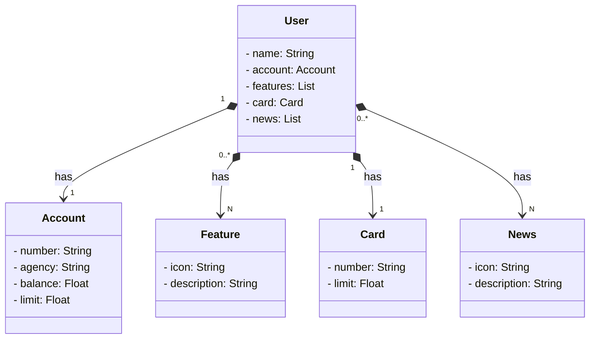

# Desafio de Projeto - Santander Dev Week 2023

Java RESTful API criada para a Santander Dev Week 2023

### Diagrama de Classes

### Modelo Santander

 - [Figma](https://www.figma.com/file/0ZsjwjsYlYd3timxqMWlbj/SANTANDER---Projeto-Web%2FMobile?type=design&node-id=2-92&mode=design&t=yRxhKzjzKWJ3XQ4J-0)
