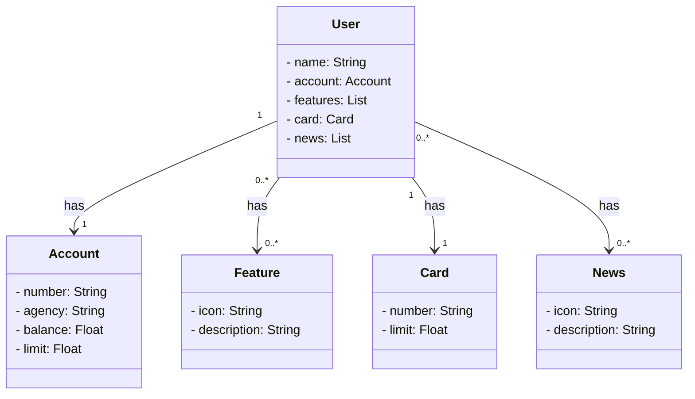

# Desafio de Projeto - Santander Dev Week 2023

Java RESTful API criada para a Santander Dev Week 2023"

### Diagrama de Classes

```mermaid

classDiagram
  class User {
    - name: String
    - account: Account
    - features: List<Feature>
    - card: Card
    - news: List<News>
  }
  class Account {
    - number: String
    - agency: String
    - balance: Float
    - limit: Float
  }
  class Feature {
    - icon: String
    - description: String
  }
  class Card {
    - number: String
    - limit: Float
  }
  class News {
    - icon: String
    - description: String
  }

  User "1" --> "1" Account: has
  User "0..*" --> "0..*" Feature: has
  User "1" --> "1" Card: has
  User "0..*" --> "0..*" News: has
```